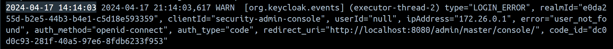
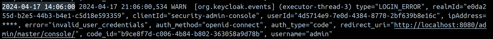
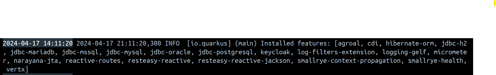

## About
Example of implementing a Quarkus extension to mask Ip Addresses in Keycloak logs.
Should be easy to build upon to integrate new filters.

Readers should be familiar with Java and Dependency Injection in Java frameworks.

### Without Extension

### With Extension

## Issues/Contributions
Please create an issue if you have any questions. Contributions are welcome. Most of the code
was put together using tutorials/documentation on the Quarkus website, stackoverflow, and 
reading Quarkus source code/test.

## References:
1. https://quarkus.io/guides/building-my-first-extension#description-of-a-quarkus-extension
2. https://quarkus.io/guides/logging#add-a-logging-filter-to-your-log-handler
3. https://github.com/keycloak/keycloak/discussions/10884
4. https://github.com/quarkusio/quarkus/issues/25981
5. https://stackoverflow.com/questions/68375755/how-to-intercept-logging-messages-with-quarkus-for-testing-purposes

## FAQ
1. How do I know that my extension has been loaded ?
Check the logs. All the installed extensions ("features") are logged when Keycloak starts.

2. How can I create an extension ?
Follow [tutorial](https://quarkus.io/guides/building-my-first-extension#description-of-a-quarkus-extension)